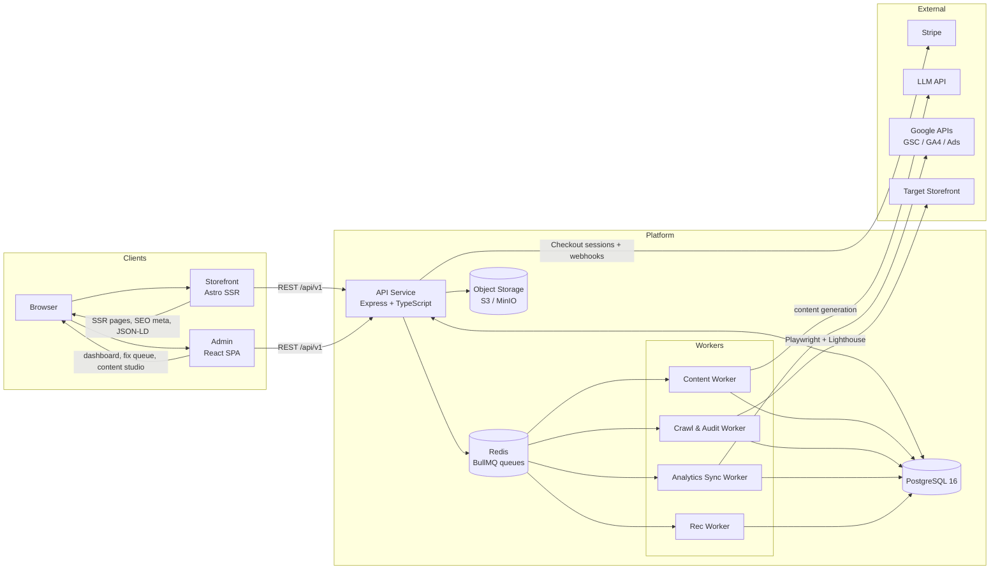

# BeautyAI

**AI-Powered Beauty Commerce & SEO Intelligence Platform**

A B2B SaaS platform that gives beauty brands a unified commerce experience with embedded AI-powered SEO intelligence — a full-stack e-commerce storefront with automated SEO auditing, AI content generation, and marketing analytics (Google Search Console, GA4, Google Ads).

## Key Features

- **Storefront (Compose)** — Performance-optimized SSR storefront with product catalog, collections, cart, Stripe checkout, order management, and customer accounts
- **AI Content Engine** — Generates SEO-optimized product descriptions, meta tags, and blog drafts that respect your brand tone
- **SEO Auditor** — Automated crawling (Playwright + Lighthouse), technical SEO issue detection, prioritised fix queue
- **Marketing Analytics** — Correlates GSC, GA4, and Google Ads into a unified dashboard
- **Multi-tenant** — Each brand gets an isolated store with RBAC (owner / editor / viewer)

## Architecture

### Data Flow



### Entity Relationship

```mermaid
erDiagram
    tenants ||--o{ tenant_memberships : "has"
    users ||--o{ tenant_memberships : "joins"
    users ||--o{ customers : "linked to"
    tenants ||--o{ products : "owns"
    tenants ||--o{ collections : "owns"
    products ||--o{ variants : "has"
    products ||--o{ product_images : "has"
    products ||--o{ product_seo : "has"
    products }o--o{ collections : "in (product_collection)"
    variants ||--o| inventory : "tracks"
    tenants ||--o{ carts : "owns"
    carts ||--o{ cart_items : "contains"
    variants ||--o{ cart_items : "line item"
    carts |o--o| orders : "converts to"
    tenants ||--o{ customers : "owns"
    customers ||--o{ customer_addresses : "has"
    customers ||--o{ orders : "places"
    orders ||--o{ order_items : "contains"
    orders ||--o{ shipments : "has"
    orders ||--o{ order_events : "records"
    tenants ||--o{ content_drafts : "owns"
    tenants ||--|| brand_tones : "configures"
    tenants ||--o{ audits : "runs"
    audits ||--o{ crawl_urls : "visits"
    audits ||--o{ audit_issues : "yields"
    audits ||--o{ seo_scores : "produces"
    tenants ||--o{ analytics_connections : "connects"
    tenants ||--o{ gsc_data : "stores"
    tenants ||--o{ ga4_data : "stores"
    tenants ||--o{ ads_data : "stores"
    tenants ||--o{ product_recommendations : "serves"
    products ||--o{ product_recommendations : "recommends"
    tenants ||--o{ subscriptions : "subscribes to"
    plans ||--o{ subscriptions : "defines"
    tenants ||--o{ invoices : "billed by"
    tenants ||--o{ refresh_tokens : "issues"
    tenants ||--o{ audit_logs : "writes"
```



## Tech Stack

| Layer | Technology |
|---|---|
| API | Express + TypeScript (modular monolith) |
| Storefront | Astro (SSR) + React islands |
| Admin | React SPA (Vite) |
| Database | PostgreSQL 16 (multi-tenant schema) |
| Cache / Queues | Redis + BullMQ |
| Object storage | S3-compatible (MinIO for dev, AWS S3/GCS for prod) |
| Payments | Stripe (Checkout + webhooks) |
| Testing | Vitest (unit + Postgres-backed integration) |

## Getting Started

**Prerequisites:** Node.js ≥ 20, Docker (for Postgres/Redis/MinIO dev services).

```bash
npm ci
cp .env.example .env.local   # configure secrets / Stripe keys
npm run db:reset             # create schema, seed demo@glow.co / Password123!
npm run dev                  # API :4000 · storefront :4321 · admin :5173
```

Storefront and customer endpoints resolve the store via the `X-Tenant-Slug` header. Stripe checkout degrades to `503` until live keys are set.

## Useful Scripts

| Command | Description |
|---|---|
| `npm run dev` | Run API, storefront, and admin concurrently |
| `npm run typecheck` | Typecheck all workspaces |
| `npm run lint` | ESLint across the repo |
| `npm run test:unit` | Unit tests |
| `npm run test:integration` | Postgres-backed integration tests |
| `npm run db:migrate` / `db:seed` / `db:reset` | Database setup helpers |

## Repository Structure

```
apps/
  api/       Express API — auth, catalog, carts, checkout, orders, customers
  web/       Astro storefront
  admin/     React admin dashboard
packages/
  db/        Postgres pool, migrations, schema helpers
  shared/    Shared types, constants, and Zod validators
docs/        PRD, architecture, API, DB schema, roadmap, ADRs
```

## Documentation

| Doc | Purpose |
|---|---|
| [docs/README.md](docs/README.md) | Documentation index and reading order |
| [docs/PRD.md](docs/PRD.md) | Product requirements: vision, scope, features, personas |
| [docs/ARCHITECTURE.md](docs/ARCHITECTURE.md) | System architecture and data flows |
| [docs/TECH_SPEC.md](docs/TECH_SPEC.md) | Technology stack and key decisions |
| [docs/API.md](docs/API.md) | REST API reference |
| [docs/DATABASE_SCHEMA.md](docs/DATABASE_SCHEMA.md) | PostgreSQL physical model |
| [docs/ROADMAP.md](docs/ROADMAP.md) | Phased build plan (P0–P6) |
| [docs/ADRs.md](docs/ADRs.md) | Architecture decision records |

## Status

Phase 0 (foundations) and Phase 1 (commerce core) are complete: catalog/admin/storefront, cart drawer, Stripe checkout, webhooks → orders, customer accounts, and SEO metadata. Next up is the AI content engine and SEO auditor.